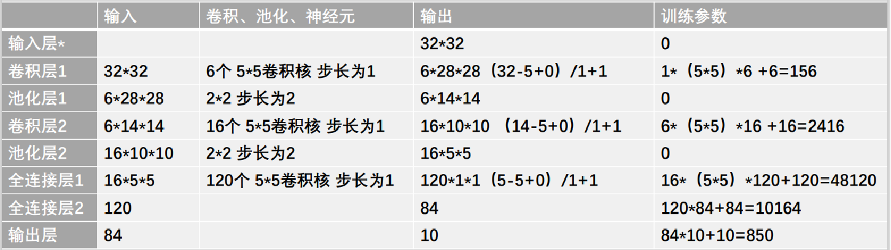

# 人工智能基础实验三-----LeNet-5识别手写数字
LeNet-5模型是Yann LeCun教授1998年在论文Gradient-Based Learning Applied to Document Recognition中提出的，它是第一个成功应用于数字识别问题的卷积神经网络。在MNIST数据集上，LeNet-5模型可以达到大约99.2%的正确率。
LeNet-5模型总共有7层。

LeNet-5共有7层（不包含输入），每层都包含可训练参数。
输入图像大小为32\*32，比MNIST数据集的图片要大一些，这么做的原因是希望潜在的明显特征如笔画断点或角能够出现在最高层特征检测子感受野（receptive field）的中心。因此在训练整个网络之前，需要对28\*28的图像加上paddings（即周围填充0）。

C1层：该层是一个卷积层。使用6个大小为5\*5的卷积核，步长为1，对输入层进行卷积运算，特征图尺寸为32-5+1=28，因此产生6个大小为28\*28的特征图。这么做够防止原图像输入的信息掉到卷积核边界之外。

S2层：该层是一个池化层（pooling，也称为下采样层）。这里采用max_pool（最大池化），池化的size定为2\*2，经池化后得到6个14\*14的特征图，作为下一层神经元的输入。

C3层：该层仍为一个卷积层，我们选用大小为5\*5的16种不同的卷积核。这里需要注意：C3中的每个特征图，都是S2中的所有6个或其中几个特征图进行加权组合得到的。输出为16个10\*10的特征图。

S4层：该层仍为一个池化层，size为2\*2，仍采用max_pool。最后输出16个5\*5的特征图，神经元个数也减少至16\*5\*5=400。

F5层：该层我们继续用5\*5的卷积核对S4层的输出进行卷积，卷积核数量增加至120。这样C5层的输出图片大小为5-5+1=1。最终输出120个1\*1的特征图。这里实际上是与S4全连接了，但仍将其标为卷积层，原因是如果LeNet-5的输入图片尺寸变大，其他保持不变，那该层特征图的维数也会大于1\*1。

F6层：该层与C5层全连接，输出84张特征图。

输出层：该层与F6层全连接，输出长度为10的张量，代表所抽取的特征属于哪个类别。（例如[0,0,0,1,0,0,0,0,0,0]的张量，1在index=3的位置，故该张量代表的图片属于第三类）

# 实验要求
完成基于LeNet-5的手写数字识别系统。
MINIST手写数字数据集下载：http://yann.lecun.com/exdb/mnist/
提交代码和实验报告。

# 实验报告内容
### 一、实验目的
### 二、实验原理
### 三、实验方法及流程
### 四、具体代码实现
### 五、实验结果及分析